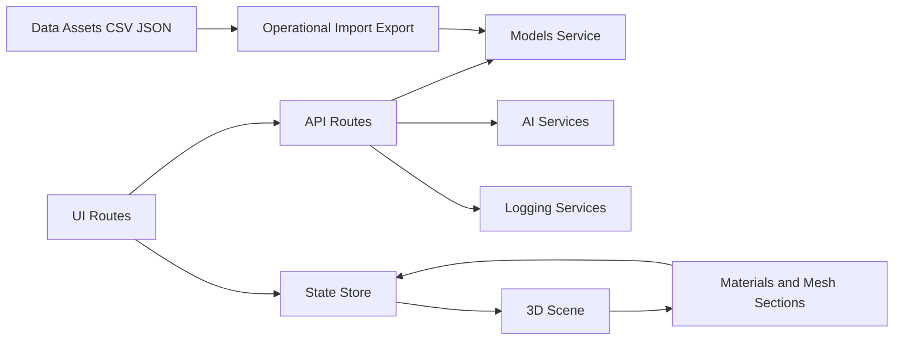

# Besu Customs Platform

A production-oriented 3D product customization platform built with Next.js, React Three Fiber, and a modular admin/API architecture.

This repository powers a full workflow:

- Model catalog management
- Real-time material and texture editing
- AI-assisted texture generation and image workflows
- Product mapping and e-commerce-related data pipelines
- Operational admin dashboards, logs, and user tooling

The project has been organized to keep runtime code clean while preserving import/export and reference assets in dedicated data and documentation directories.

---

## Table of Contents

1. Platform Purpose
2. What We Do End-to-End
3. Core Capabilities
4. Product and User Flows
5. Architecture Overview
6. Technology Stack
7. Repository Structure
8. Route Catalog
9. API Catalog
10. State Management and Data Model
11. 3D Rendering and Material Pipeline
12. AI and Image Workflows
13. Data Operations and File Organization
14. Local Development
15. Environment Variables
16. Build and Deployment
17. Observability and Logging
18. Performance Strategy
19. Security and Operational Notes
20. Troubleshooting Guide
21. Maintenance Notes and Recent Changes
22. Contribution Guidelines
23. Roadmap Suggestions
24. Glossary

---

## 1. Platform Purpose

Besu Customs is a configurable 3D commerce and design system focused on apparel and related products. The platform allows teams and customers to customize model colors, material sections, and generated textures across a growing catalog of sports and lifestyle products.

At a high level, this project exists to solve three practical problems:

- Turn static 3D assets into interactive customization experiences
- Standardize complex material naming and section mapping across inconsistent source models
- Connect design workflows to operational tooling (admin dashboards, logs, syncing, export/import data)

---

## 2. What We Do End-to-End

The platform supports the complete loop from model ingestion to design output:

1. Import or maintain a model catalog
2. Detect and normalize material/mesh sections
3. Present editable sections in a guided wizard UI
4. Apply colors, trims, decals, layers, and optional AI-generated textures
5. Persist state and support operational actions through admin APIs
6. Export or send final design payloads for downstream workflows

The codebase includes dedicated tooling for:

- Material extraction
- Model metadata and status updates
- Logging and geo/log endpoints
- AI generation integrations
- Product/model linking

---

## 3. Core Capabilities

### Customer/Configurator Side

- 3D model viewing with dynamic loading
- Material section editing and color workflows
- Layer controls and guided wizard steps
- Mobile-aware UI behavior and performance guards
- Texture and UV-related editing workflows

### Admin Side

- Admin dashboard and analytics pages
- Models management and sync controls
- User management endpoints and views
- Logs and activity visualizations
- Settings/system utilities

### API and Backend Integration Side

- Model retrieval, filtering, status changes, deletion
- Material extraction from GLB assets
- Logs ingestion and geo log support
- AI generation endpoints for image/texture workflows
- Token/query/create helpers for Hitem-style endpoints

---

## 4. Product and User Flows

### Standard Configurator Flow

1. User opens the main configurator route
2. A model is selected and loaded into the 3D scene
3. Materials are extracted or fetched and normalized into sections
4. User edits sections, textures, and layer composition
5. User previews and finalizes design

### Admin Model Operations Flow

1. Admin opens model management pages
2. Admin checks model health/stats/sync status
3. Admin toggles active or featured flags through API
4. Admin may delete or test model data paths

### AI Texture/Creative Flow

1. User/admin submits prompt or source image
2. AI integration endpoint processes request
3. Resulting image/texture is applied as layer/texture input
4. User adjusts placement or section targeting

---

## 5. Architecture Overview

### Runtime Layers

- App Router pages under app
- Feature and UI components under components
- Shared state and service logic under lib
- Hooks and provider wiring under hooks and providers

### Non-Runtime Layers

- Structured data artifacts under data
- Long-form docs and SQL under docs

---

## 6. Technology Stack

### Framework and Runtime

- Next.js 16 (App Router)
- React 19
- TypeScript

### 3D and Graphics

- three
- @react-three/fiber
- @react-three/drei
- fabric and react-konva integrations in feature areas

### UI and Interaction

- Tailwind CSS v4 stack
- Radix UI primitives
- Framer Motion
- Sonner toasts

### Data and Platform Integrations

- Supabase client
- Vercel analytics and toolbar integration
- AI SDK/service wrappers in local libs and hooks

---

## 7. Repository Structure

Top-level structure is intentionally split between runtime application code and operational assets.

- app: Next.js routes and API handlers
- components: reusable and feature-level UI components
- hooks: custom hooks for domain behavior
- lib: services, stores, utilities, data access, integrations
- providers: app-level provider wrappers
- public: static assets, model and media files
- styles: additional style entry points
- types: project type declarations
- data: non-runtime CSV/JSON/asset artifacts used for imports, references, and tooling
- docs: markdown and SQL documentation assets
- scripts: utility scripts

See also:

- data/README.md
- docs/sql/README.md
- docs/markdown/README.md

---

## 8. Route Catalog

### User-Facing and Core Routes

- / : Main configurator
- /review : Review/demo route
- /materials : Material-focused route
- /texture-generator : Texture generation route
- /login : Authentication route
- /signup : Authentication route

### Admin Routes

- /admin
- /admin/models
- /admin/orders
- /admin/users
- /admin/settings
- /admin/system
- /admin/logs
- /admin/analytics
- /admin/analytics/user-activity
- /admin/ai-generator

### Error and Support Routes

- Global and local error boundaries defined in app-level error files

---

## 9. API Catalog

API handlers are under app/api and follow route-based conventions.

### Model and Material APIs

- GET /api/models
  - Supports active filtering and category filtering
  - Returns fallback catalog when primary source fails
- PATCH /api/models
  - Updates model flags such as active/featured
- DELETE /api/models
  - Deletes a model by id
- GET /api/models/stats
- GET /api/models/sync
- GET /api/models/test
- GET /api/materials
  - Reads model query parameter
  - Extracts material/mesh data and performs model-specific renaming logic

### Extraction and Processing APIs

- /api/extract-materials
- /api/extract-material-names

### AI and Image APIs

- /api/generate-image
- /api/gemini/generate-texture
- /api/meshy/retexture
- /api/meshy/image-proxy

### Operational and Utility APIs

- /api/logs
- /api/logs/geo
- /api/auth/user
- /api/admin/users
- /api/send-design
- /api/settings/runware
- /api/hitem/token
- /api/hitem/query
- /api/hitem/create

---

## 10. State Management and Data Model

Global configurator state is centralized in a Zustand store with persisted storage behavior.

Key state domains include:

- Product catalog and selected product/model
- Material sections, highlights, and linked editing behavior
- Texture layers with ordering, locking, blend mode, and transforms
- UV map and mask references
- Scene controls, camera state, and visual toggles
- Mobile panel state and onboarding state
- Model load/error states

Representative domain types in the store include:

- Product
- MaterialSection
- TextureLayer
- EntranceAnimationType

This centralized shape supports both guided step-based UI and direct power-user controls.

---

## 11. 3D Rendering and Material Pipeline

The main page dynamically loads the 3D scene component in client mode to avoid server-side rendering constraints for WebGL-heavy modules.

Material pipeline behavior includes:

- Model load and section extraction
- Name normalization and category assignment
- Model-specific rename maps for clearer UI labels
- Per-section color/roughness/metalness edits
- Optional texture and gradient overlays

The codebase contains both current and legacy/deprecated utility files, preserving historical migration context while keeping active logic in current utility modules.

---

## 12. AI and Image Workflows

AI flows are represented in both hooks and API handlers, with multiple integration paths. Typical capabilities include:

- Prompt-based texture or image generation
- Image proxying/retexturing workflows
- Integration settings endpoints

Supporting utility modules in lib handle memory, processing, and compositing concerns that bridge generated output into render-ready textures.

---

## 13. Data Operations and File Organization

Operational data was organized into clear subdomains for maintainability.

### CSV Organization

- data/csv/imports/configurator
- data/csv/imports/shopify
- data/csv/references
- data/csv/inventory
- data/csv/checkout
- data/csv/exports

### JSON Organization

- data/json/maps
- data/json/generated
- data/json/summaries

### Shopify and Misc Operational Assets

- data/shopify

### SQL Docs Organization

- docs/sql/migrations
- docs/sql/scripts
- docs/sql/supabase_schema.sql

This structure keeps root-level noise low and improves discoverability for non-runtime artifacts.

---

## 14. Local Development

### Prerequisites

- Node.js LTS compatible with Next.js 16
- pnpm

### Install

1. Install dependencies:

   pnpm install

2. Configure environment variables in .env

3. Start local server:

   pnpm run dev

4. Build for production check:

   pnpm run build

5. Lint:

   pnpm run lint

---

## 15. Environment Variables

Define environment variables in your local .env file and deployment provider settings.

Common variables observed/expected in this project include:

- NEXT_PUBLIC_GOOGLE_API_KEY
- GEMINI_API_KEY
- SMTP_HOST
- SMTP_PORT
- SMTP_USER
- SMTP_PASS
- NEXT_PUBLIC_ENABLE_VERCEL_ANALYTICS

If using Vercel Toolbar on localhost, also ensure project linking and toolbar config are properly set through Vercel tooling and Next plugin configuration.

Important:

- Never commit live credentials
- Rotate keys immediately if secrets were ever exposed
- Use provider secret management for production

---

## 16. Build and Deployment

### Scripts

- pnpm run dev
- pnpm run build
- pnpm run start
- pnpm run lint

### Deployment Notes

- Next standalone output is enabled
- Compression and static caching headers are configured
- Asset and model paths use rewrite/header rules for caching and compatibility
- Vercel config file controls function limits and output directory behavior

---

## 17. Observability and Logging

The repository includes first-class logging routes and admin views for operational visibility.

Current observability-related elements include:

- API routes for logs and geo log intake
- Admin log viewer surfaces
- Error boundary components and app-level error initialization
- Optional Vercel analytics integration

For production readiness, keep logs structured and avoid storing sensitive payloads in clear text.

---

## 18. Performance Strategy

Performance is addressed at multiple levels:

- Dynamic client-only loading for heavy 3D components
- Optimized package import settings in Next config
- Cache headers for static assets and models
- Server bundle exclusions for heavy client-focused libraries
- Mobile-specific hooks and utilities
- Model caching and optimized loaders in lib

---

## 19. Security and Operational Notes

- Protect API endpoints with appropriate auth/role checks where needed
- Sanitize user prompts and uploaded content paths
- Review email and AI endpoints for abuse controls and rate limiting
- Keep dependency versions patched
- Avoid storing secrets in source files or public routes

---

## 20. Troubleshooting Guide

### Dev server starts but toolbar warning appears

- Ensure toolbar plugin is configured in Next config
- Ensure local project is linked with Vercel if toolbar comments are required
- Render toolbar conditionally when config identifiers are unavailable

### Model materials fail to load

- Verify model URL path exists in public assets
- Check /api/materials query parameter value and network response
- Confirm model-specific rename/normalization logic still matches current asset names

### Fallback models returned unexpectedly

- Check data source/service availability in models service
- Inspect server logs for model fetch exceptions

### AI generation issues

- Verify required API keys and settings endpoints
- Check timeout and request payload size constraints

---

## 21. Maintenance Notes and Recent Changes

Recent repository improvements include:

- Root-level cleanup into data and docs directories
- Deep organization inside CSV/JSON/SQL operational folders
- Added data and SQL README index files
- Updated toolbar integration behavior to avoid noisy missing-config warnings in development environments

The maintenance strategy is to keep runtime code paths stable while incrementally improving discoverability and operational hygiene.

---

## 22. Contribution Guidelines

### Branching and PR Recommendations

- Use focused branches per feature/fix
- Keep PRs scoped and reviewable
- Prefer additive migrations for data model changes

### Code Guidelines

- Preserve existing architecture boundaries
- Avoid mixing operational scripts into runtime app directories
- Add concise comments only where logic is non-obvious

### Validation Checklist

- App boots locally
- Relevant routes and APIs respond correctly
- No new lint/type errors in touched files
- Data/docs moves do not break runtime imports

---

## 23. Roadmap Suggestions

Potential next steps for the platform:

- Expand automated tests for core API routes and store logic
- Add schema validation for all API payloads
- Build stronger role-based access controls for admin actions
- Introduce background job queue for heavy AI/image tasks
- Add formal migration and data contract versioning
- Expand observability dashboards with alert thresholds

---

## 24. Glossary

- Material Section: A user-editable visual segment mapped to one or more source materials
- UV Map: 2D projection coordinates used to apply textures to 3D geometry
- Decal Layer: Image/text/pattern layer projected or composited onto a model
- Fallback Catalog: Backup model list used when primary data source is unavailable
- Configurator Wizard: Step-based UI guiding users through product customization

---

## Final Notes

This repository is both a customer-facing configurator and an operations toolkit. Runtime code, admin capabilities, and data pipelines are designed to evolve together. The current structure emphasizes maintainability, clearer ownership boundaries, and safer day-to-day development operations.
